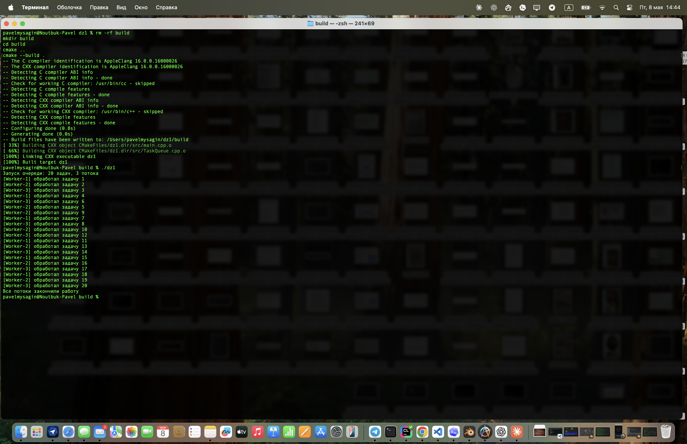

# Отчет по работе

## 1. Титульная информация

- **ФИО:** Мысягин Павел Аркадьевич
- **Группа:** СКБ 251
- **Дисциплина:** Языки программирования
- **Тема работы:** Потокобезопасная очередь задач на C++

## 2. Постановка задачи

Необходимо разработать консольное приложение на C++, в котором несколько рабочих потоков обрабатывают задачи из общей очереди.

По условию работы требуется создать класс `TaskQueue`, реализующий потокобезопасную очередь задач. Для синхронизации доступа к очереди должны использоваться `std::mutex` и `std::condition_variable`.

В очередь добавляются задачи с номерами от 1 до 20. Несколько рабочих потоков забирают задачи из очереди, обрабатывают каждую задачу примерно 1 секунду и выводят результат работы в консоль в формате:

[Worker-2] обработал задачу 7

## 3. Описание реализации

Программа состоит из трёх основных файлов:

`main.cpp` — запуск программы, создание потоков и добавление задач;
`TaskQueue.h` — объявление класса `TaskQueue`;
`TaskQueue.cpp` — реализация потокобезопасной очереди.

#### Архитектура программы

В `main.cpp` задаются основные параметры работы программы:

```cpp
const int tasksCount = 20;
const int threadsCount = 3;
const int taskDelaySeconds = 1;
```

`tasksCount` отвечает за количество задач, `threadsCount` — за количество рабочих потоков, а `taskDelaySeconds` — за время обработки одной задачи.

В функции `main()` создаются:

```cpp
TaskQueue queue;
std::mutex coutmutex;
std::vector<std::thread> potoki;
```

`queue` хранит задачи, `coutmutex` нужен для аккуратного вывода в консоль, а `potoki` хранит созданные рабочие потоки.

Общий порядок работы программы:

1. создаётся очередь задач;
2. запускаются рабочие потоки;
3. в очередь добавляются задачи от 1 до 20;
4. очередь закрывается после добавления всех задач;
5. главный поток ждёт завершения рабочих потоков через `join()`.

#### Потокобезопасная очередь

Очередь задач реализована в отдельном классе `TaskQueue`.

Внутри класса находятся:

```cpp
std::queue<int> ochered;
std::mutex mtx;
std::condition_variable cv;
bool closed;
```

`std::queue<int>` хранит номера задач.  
`std::mutex` защищает очередь от одновременного доступа из нескольких потоков.  
`std::condition_variable` позволяет потокам ждать появления задач без постоянной проверки очереди.  
`closed` показывает, что новые задачи больше не будут добавляться.

Метод `push()` добавляет задачу в очередь:

```cpp
void TaskQueue::push(int zadacha) {
    {
        std::lock_guard<std::mutex> lock(mtx);

        if (closed) {
            return;
        }

        ochered.push(zadacha);
    }

    cv.notify_one();
}
```

Сначала очередь блокируется через `std::lock_guard`, затем задача добавляется в `ochered`. После этого вызывается `cv.notify_one()`, чтобы запустить один поток, который ожидает новую задачу.

Метод `pop()` забирает задачу из очереди:

```cpp
bool TaskQueue::pop(int& zadacha) {
    std::unique_lock<std::mutex> lock(mtx);

    cv.wait(lock, [this]() {
        return !ochered.empty() || closed;
    });

    if (ochered.empty() && closed) {
        return false;
    }

    zadacha = ochered.front();
    ochered.pop();

    return true;
}
```

Если очередь пустая, поток не крутится в цикле, а  засыпает на `cv.wait()`. Поток просыпается, когда в очереди появляется задача или когда очередь закрывается.

Если очередь закрыта и задач больше нет, метод возвращает `false`. Это означает, что рабочему потоку пора завершать работу.

#### Использование `condition_variable`

`condition_variable` используется для ожидания задач:

```cpp
cv.wait(lock, [this]() {
    return !ochered.empty() || closed;
});
```

Здесь поток ждёт, пока выполнится одно из двух условий либо в очереди появилась задача либо очередь была закрыта методом `stop()`.

Такой подход нужен, чтобы не было busy-wait. Поток не проверяет очередь постоянно, а ждёт уведомления от `push()` или `stop()`.

Когда добавляется новая задача, вызывается:

```cpp
cv.notify_one();
```

От этого просыпается один ожидающий поток.

Когда очередь закрывается, вызывается:

```cpp
cv.notify_all();
```

Это будит все ожидающие потоки, чтобы они могли проверить состояние очереди и корректно завершиться.

#### Механизм корректного завершения потоков

После добавления всех задач вызывается метод `stop()`:

```cpp
void TaskQueue::stop() {
    {
        std::lock_guard<std::mutex> lock(mtx);

        if (closed) {
            return;
        }

        closed = true;
    }

    cv.notify_all();
}
```

Флаг `closed` становится равным `true`, и все ожидающие потоки просыпаются.

Рабочий поток выполняет цикл:

```cpp
while (queue.pop(zadacha)) {
    obrabotat(id, zadacha, coutmutex);
}
```

Пока `pop()` возвращает `true`, поток получает задачу и обрабатывает её. Когда задач больше нет и очередь закрыта, `pop()` возвращает `false`, цикл заканчивается, и поток выходит из функции.

В основном потоке используется функция `joinworkers()`:

```cpp
void joinworkers(std::vector<std::thread>& potoki) {
    for (std::size_t i = 0; i < potoki.size(); ++i) {
        potoki[i].join();
    }
}
```

Она вызывает `join()` для каждого рабочего потока. Благодаря этому программа не завершается раньше времени, а ждёт, пока все потоки закончат обработку задач.

## 4. Демонстрация работы

Исходный код проекта лежит в GitHub-репозитории:

```text
https://github.com/KleinO1/dz1
```

Программа была собрана и запущена в терминале как консольное приложение.

Сначала была выполнена чистая сборка проекта:

```bash
rm -rf build
mkdir build
cd build
cmake ..
cmake --build .
```

После успешной сборки программа была запущена командой:

```bash
./dz1
```

В консоли видно, что приложение добавило в очередь 20 задач и запустило 3 рабочих потока:

```text
Запуск очереди: 20 задач, 3 потока
```

Далее рабочие потоки начали обрабатывать задачи из общей очереди. Вывод программы имеет следующий вид:

```text
[Worker-1] обработал задачу 1
[Worker-2] обработал задачу 2
[Worker-3] обработал задачу 3
...
[Worker-3] обработал задачу 20
```

Порядок строк может отличаться при разных запусках, так как задачи выполняются несколькими потоками параллельно.

После обработки всех задач программа вывела сообщение:

```text
Все потоки закончили работу
```

Это показывает, что рабочие потоки завершились корректно, а основной поток дождался их завершения с помощью `join()`.

Скриншот работы программы:



На скриншоте видно запущенное приложение, вывод в консоль, а также Dock/task-bar и системное время.
## 5. Выводы

В ходе работы была разработана консольная программа на C++, которая обрабатывает очередь задач с помощью нескольких потоков.

В программе был реализован класс `TaskQueue`, внутри которого хранится очередь задач и находятся средства синхронизации: `std::mutex` и `std::condition_variable`. Благодаря этому несколько потоков могут безопасно брать задачи из общей очереди.

Использование `condition_variable` позволило избежать busy-wait. Если задач в очереди нет, поток не проверяет её постоянно, а ждёт уведомления о появлении новой задачи или о завершении работы очереди.

Также был реализован корректный механизм завершения потоков. После добавления всех задач очередь закрывается, ожидающие потоки просыпаются, обрабатывают оставшиеся задачи и завершают работу. Основной поток дожидается завершения всех рабочих потоков с помощью `join()`.

В результате программа выполняет требования задания: создаёт задачи с номерами от 1 до 20, обрабатывает каждую задачу примерно 1 секунду, выводит результат работы потоков в консоль и корректно завершает выполнение.